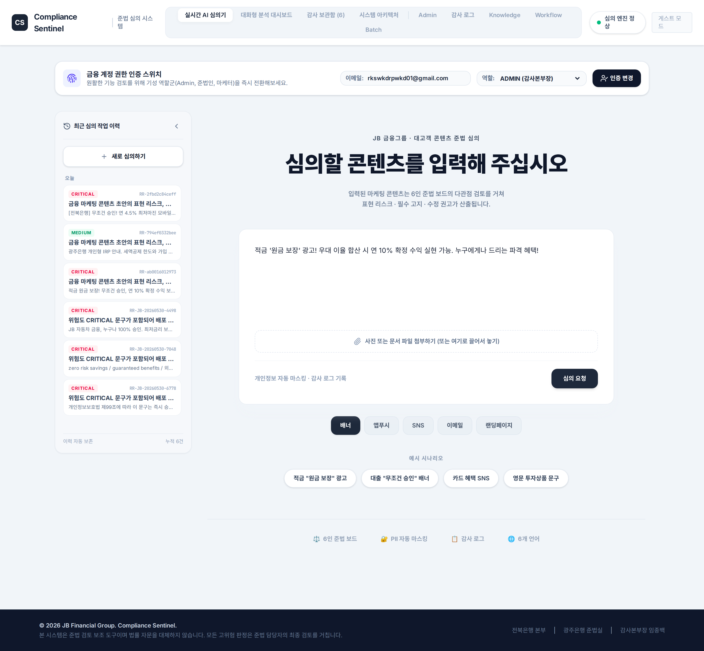

# Compliance Sentinel — 금융 마케팅 콘텐츠 AI 심의관

> **JB금융그룹 Fin:AI Challenge 지정주제 2 — Compliance AI / 준법자문가 AI Agent 서비스 개발** 출품용 MVP
>
> Compliance Sentinel은 대고객 금융 마케팅 콘텐츠 초안(광고, 배너, SNS, 앱푸시, 이메일, 랜딩페이지, 다국어 문구)을 입력받아 **표현 리스크 탐지 → 근거 검색 → 수정안 생성 → 검증 → 승인/HITL 라우팅 → 감사 로그/업무 연계**까지 수행하는 AI Agent 시스템입니다.

[](tests/)
[](pyproject.toml)
[](scripts/run_demo.py)

---

## 0. 본선 제출 요건 대응 & 심사위원 재현 가이드

JB금융그룹 Fin:AI Challenge **본선 GitHub 제출 요건**과 본 저장소의 대응 위치입니다. 기본값은 deterministic mode라 **API key 없이 clone → 설치 → 실행 → 검증**이 그대로 재현됩니다.

| 제출 요건 | 대응 | 위치 |
|---|---|---|
| ① 서비스 실행 코드 | Python 심의 엔진 + Streamlit/React UI + MCP 서버 | `src/`, `apps/`, `compliance-sentinel/`, §17 |
| ② README 파일 | 본 문서 | `README.md` |
| ③ 실행 방법·환경 설정 안내 | 아래 재현 절차 + 환경변수 표 | §0, §11~14 |
| ④ 주요 기능별 코드/모듈 | 디렉터리 구조 + 모듈별 책임 | §17, §5, §7 |
| ⑤ 사용 데이터·외부 API 설명 | KB 139건 + 법령정보센터 API + LLM provider | §0(아래), §13, §16 |
| ⑥ 심사·재현성 확인 자료 | 전체 테스트 + 운영 readiness 리포트 | §11, §16 |

### 0.1 재현 절차 (복사 실행 — API key 불필요)

```bash
git clone <이 저장소 URL>
cd JB_Project-Compliance-Sentinel
python -m pip install -e .[dev]          # Python 3.10+

# 1) 6언어 심의 데모
PYTHONPATH=src python scripts/run_demo.py

# 2) 단일 콘텐츠 분석
PYTHONPATH=src python -m compliance_sentinel.cli --json \
  "JB 슈퍼적금 출시! 누구나 연 8% 확정 수익, 원금 보장!"

# 3) 전체 테스트 (재현성 확인) → fresh venv + ".[dev]"만으로 "1489 passed, 50 skipped, 0 failed" 재현 (§16)
#    passed 수는 설치된 optional deps에 따라 변동: 최소 ~1474 · .[dev] 1489 · 전체 extras 1545.
#    skip은 optional extras(llm/mcp/rag/telemetry/langgraph 등) 미설치 시 자동 발생 — 실패 아님.
#    ✅ failed=0 은 모든 설치 환경에서 불변 (배지의 핵심 품질 지표). 배지 passed 수는 문서화된 .[dev] 기준.
PYTHONPATH=src python -m pytest -q
```

> 실시간 입력 가드(prompt injection 탐지)는 외부 툴 없이 율리 native로 동작합니다(§0.3). 외부 거버넌스 툴 연동 게이트(`run_three_tool_integration.py`)는 로컬에 툴이 있을 때만 실행되는 선택 사항이며 코어 재현에는 불필요합니다.

### 0.2 사용 데이터 & 외부 API (요건 ⑤ 요약)

| 구분 | 내용 | 필수 여부 |
|---|---|---|
| 내부 지식베이스(KB) | `data/laws.json` — 법령/내부기준 **139건**(내부 적용요약 123 + 공식/외부 16, 공식 원문 15 포함, 상세 §16) | 저장소에 번들 (필수) |
| 법령정보센터 Open API | `LAW_OPEN_API_KEY` — 공식 법령 원문 fetch (`scripts/fetch_law_open_api_articles.py`) | opt-in |
| LLM Provider | `ANTHROPIC_API_KEY`(기본) 또는 `OPENAI_API_KEY` — 6인 보드 LLM 판단 | opt-in (미설정 시 deterministic) |
| Qdrant / Slack / LangSmith | dense RAG / 승인 연계 / eval 추적 | opt-in |

> 외부 API·key는 **전부 opt-in** — 미설정 시 전체 파이프라인이 deterministic 경로로 동작합니다. 상세 환경변수는 §13.

### 0.3 저장소 접근성 (요건 ※ 주의사항 대응)

- **율리는 외부 툴 없이 self-contained로 동작합니다.** 실시간 입력 가드(prompt injection 탐지)는 율리 내부 native 코드(`agent_shield_bridge.py`의 regex 가드 + `input_guard_detectors.py`의 한국어 포함 semantic 탐지)로 제공됩니다 — 별도 설치/의존 없음.
- 이 프로젝트는 **개발 과정에서 3개 거버넌스 툴(AgentShield/AgentLoop/AgentCompiler)을 활용해 구현·검증**되었습니다. 그중 **AgentShield의 실시간 보안 가드는 율리 내부에 native로 내재화**(제출 레포 포함)되어 외부 툴 없이 동작합니다. **AgentLoop/AgentCompiler는 실시간이 아닌 정적 검증·최적화 툴**이라 별도 재사용 자산으로 제출 레포에서 제외했습니다(개발/배포 게이트 전용). 로컬에 존재하면 bridge가 ML/의미 탐지를 추가 위임(progressive enhancement)하지만, 없어도 native 가드가 동작합니다. 상세: §8.4.
- React UI + E2E 재현은 §12-1 참조(`npm install` + `npx playwright install chromium`).
- 본 저장소는 public 접근 가능해야 하며, 접근 권한 문제 시 제출 누락 간주됩니다(요건 명시).

---

## 1. 한 줄 요약

**Compliance Sentinel은 “준법 담당자가 대고객 콘텐츠를 수작업으로 심의하는 병목”을 “AI가 1차 준법 심의·근거 정리·수정안 작성·승인 라우팅을 자동화하고, 준법 담당자는 고위험/충돌/불확실 케이스를 검토·승인하는 방식”으로 전환하는 시스템입니다.**

기본값은 API key 없이 재현 가능한 deterministic mode입니다. 운영/시연 환경에서는 LLM, LangGraph, LangSmith, 법령정보센터 API, Qdrant, Slack webhook, MCP 서버를 opt-in으로 연결할 수 있습니다.

---

## 2. PDF 요구사항 재검토 결과

검토 대상 문서:

```text
[데이콘] JB금융그룹 Fin AI Challenge 상세주제 안내.pdf
```

PDF 3페이지의 지정주제 2는 다음 문제의식과 기대 방향을 제시합니다.

### 2.1 PDF 지정주제 2 핵심 요구

| PDF 항목 | 요구 내용 | README 반영 위치 |
|---|---|---|
| 현행 분석 | 대고객 콘텐츠 전반을 준법 관리자가 대부분 수작업 심의 | §1, §3, §6 |
| 현행 분석 | 외국어/다국어 콘텐츠도 동일 인력이 동일 방식으로 수행 | §3, §7.1, §11 |
| 현행 분석 | 심의 지연으로 콘텐츠 배포 적시성 손실 | §3, §6, §12 |
| 현행 분석 | 심의 품질 편차 및 휴먼에러 가능성 | §6, §7.3, §10 |
| 한계점 | 준법 심의 병목으로 콘텐츠 적시성/확장성 제한 | §1, §3, §7 |
| 한계점 | 다국어·다채널 확장 시 심의 리소스가 선형 증가 | §7.1, §11 |
| 한계점 | 규제 변경 즉시 반영 어려움 | §7.2, §9, §14 |
| 기대 방향성 | AI 규제 Agent가 최신 금융규제와 내부 기준 자동 추적 | §7.2, §9, §14 |
| 기대 방향성 | 콘텐츠 초안 위반 가능성·표현 리스크·수정 제안 자동 도출 | §4, §6, §10 |
| 기대 방향성 | 준법 관리자는 AI 결과 검토·승인 역할 중심으로 전환 | §6, §7.3, §10 |
| 기대 방향성 | 승인 결과를 마케팅/제작 프로세스와 자동 연계 | §7.4, §12 |
| 기능 예시 | 규제 문서 검색·참조 근거 제공 | §7.2, §9 |
| 기능 예시 | 다국어 콘텐츠 이해 및 표현/준법 리스크 분류 | §7.1, §11 |
| 기능 예시 | 콘텐츠 유형별 심의 기준 구조화 + 규칙/LLM 결합 | §7.5, §8 |

### 2.2 이행 수준 요약

| PDF 요구 | 구현 상태 | 현재 판단 |
|---|---|---|
| 최신 금융규제·내부 기준 자동 추적 | Local KB 139건(검증된 내부 심의 적용요약 123건 + 공식/외부 16건, 공식 원문 15건 포함, 고유 법령/기준 48개) + 법령정보센터 parser/client + Qdrant wrapper + RAG fallback | **MVP 기준 운영 가능**. placeholder/unverified 0건으로 `production_ready=True`; 단 공식 법령 원문 확대는 운영 고도화 과제 |
| 콘텐츠 초안 위반 가능성 도출 | rule-based reviewer, forbidden expression pack, 상품/채널/언어 분류, board finding | **구현됨** |
| 표현 리스크 분류 | `LOW/MEDIUM/HIGH/CRITICAL`, `approval_status`, confidence 5등급 | **구현됨** |
| 수정 제안 자동 도출 | 위험 표현별 보수적 대체 문구, 필수 고지 보강, revision suggestions | **구현됨** |
| 준법 담당자 검토·승인 workflow | `APPROVED`, `APPROVE_WITH_CHANGES`, `REJECTED`, `HUMAN_REVIEW_REQUIRED`, audit id | **구현됨** |
| 마케팅/제작 프로세스 자동 연계 | Slack/Notion payload, Slack live webhook opt-in | **부분 운영 가능**. Slack은 실제 POST 경로 존재, Notion은 payload/plan 단계 |
| 다국어 콘텐츠 리스크 분류 | 한국어 + 영어/중국어/베트남어/일본어/인도네시아어 위험 표현 탐지 | **구현됨** |
| 규칙 기반 + LLM 판단 결합 | deterministic baseline + fixed OpenAI LLM advisory/critic opt-in | **구현됨** |

**종합 판단:** PDF 지정주제 2의 핵심 방향성은 충실히 이행하고 있습니다. 현재 KB는 placeholder/unverified 0건으로 `production_ready=True`를 통과합니다. 다만 “최신 규제 자동 추적 완전 자동화”로 과장하지 않고, 법령 API/Qdrant/LangSmith/Slack 등은 opt-in 운영 경로이며 공식 법령 원문 확대는 본선/운영 고도화 과제로 분리합니다.

---

## 3. 제품 범위

| 구분 | 범위 | 역할 |
|---|---|---|
| Primary | 금융 광고, 배너, SNS, 앱푸시, 이메일, 랜딩페이지, 다국어 마케팅 문구 | 표현 리스크 탐지, 필수 고지 누락 확인, 수정안 생성, 승인 workflow 발행 |
| Supporting | 약관, 개인정보, 신용정보, 전자금융/거래 시나리오 | 마케팅 문구의 법령 근거, 동의/고지/설명의무, 소비자 오인 가능성 보강 검증 |
| Out of scope | 최종 법률 자문, 금융거래 실행, 상품 자동 승인, 고객 원장 실조회 | 사람이 승인해야 하는 영역으로 분리 |

---

## 4. 시스템 출력

입력 콘텐츠 1건을 분석하면 `final_report`에 다음 정보가 포함됩니다.

```json
{
  "review_type": "marketing_content_compliance",
  "approval_status": "APPROVED | APPROVE_WITH_CHANGES | REJECTED | HUMAN_REVIEW_REQUIRED",
  "risk_level": "LOW | MEDIUM | HIGH | CRITICAL",
  "confidence": "PERFECT | VERIFIED | PARTIAL | FEEDBACK | FAILED",
  "language": "ko | en | zh | vi | ja | id | unknown",
  "channel": "banner | app_push | sns | email | landing_page | notice | unknown",
  "product_type": "deposit | loan | card | investment | insurance | unknown",
  "findings": ["위험 표현, 법령/내부 기준 근거, 적용 이유"],
  "revision_suggestions": ["보수적 대체 문구 및 필수 고지 보강"],
  "board_diagnostics": "6인 보드 의견 분포/충돌/중재 필요 여부",
  "rag_metadata": "KB/RAG/Memory/Qdrant 상태",
  "rag_quality_gates": "RAG 근거 품질 gate 결과",
  "workflow_publish_plan": "Slack/Notion payload 및 live publish 상태",
  "audit_log_id": "AUD-...",
  "disclaimer": "법률 자문이 아닌 준법 검토 보조 결과"
}
```

---

## 5. 아키텍처

```text
Financial Marketing Content Draft
  + Optional Terms / Privacy / Transaction Context
  → PII / Sensitive Data Redaction
  → Input Routing
      ├─ Marketing Content Review Agent       # primary path
      └─ General Compliance Agent             # supporting verifier path
  → Language / Channel / Product Classification
  → Knowledge Retrieval
      ├─ Local KB: laws.json + jb_terms.json
      ├─ Law Open API optional fetch
      ├─ Document RAG JSONL fallback
      └─ Qdrant dense retrieval optional
  → Rule-Based Review
  → Optional Provider-Agnostic LLM Advisory Board
  → 6-Persona Compliance Board
  → Board Diagnostics / Arbitration Trigger
  → Revision Generator
  → 5-Claim Verifier / Cross-Model Critic
  → Approval Decision
  → Slack/Notion Payload or Slack Live Webhook
  → Append-only Audit Log
  → Optional LangGraph Checkpoint / HITL Runtime
  → Optional LangSmith Redacted Trace / Eval
```

---

## 6. PDF 문제의식별 구현 대응

### 6.1 수작업 심의 병목 해소

- `engine.py`가 입력을 마케팅 콘텐츠 심의 경로와 일반 준법 경로로 라우팅합니다.
- `marketing_workflow.py`가 콘텐츠 심의 전용 workflow를 수행합니다.
- 위험 표현 탐지, 수정안, 승인 상태, workflow payload가 한 번에 생성됩니다.

### 6.2 심의 품질 편차와 휴먼에러 완화

- deterministic rule layer가 기본 1차 탐지를 수행합니다.
- 6인 컴플라이언스 보드가 관점별 판단을 남깁니다.
- `BoardDiagnostics`가 다수 의견만 남기지 않고 minority opinion, contradiction pair, disagreement score를 보존합니다.
- 검증 실패, 보드 충돌, 고위험 표현은 `HUMAN_REVIEW_REQUIRED`로 라우팅됩니다.

### 6.3 준법 담당자 역할 전환

준법 담당자는 모든 콘텐츠를 처음부터 읽는 대신 다음 항목을 검토합니다.

- AI가 탐지한 위험 표현
- 근거 조문/내부 기준/RAG chunk
- 수정안
- 보드 충돌 여부
- verifier status
- audit id
- Slack/Notion 업무 payload

### 6.4 마케팅/제작 프로세스 연계

- 기본은 Slack/Notion payload 생성입니다.
- `CS_ENABLE_WORKFLOW_PUBLISH=1`과 `SLACK_WEBHOOK_URL`을 설정하면 Slack incoming webhook으로 실제 POST를 수행합니다.
- Notion은 현재 payload/plan 단계이며 live API 쓰기는 다음 단계입니다.

---

## 7. 핵심 기능

### 7.1 다국어·다채널 심의

지원 언어:

- 한국어 `ko`
- 영어 `en`
- 중국어 `zh`
- 베트남어 `vi`
- 일본어 `ja`
- 인도네시아어 `id`

지원 채널:

- 배너
- 앱푸시
- SNS
- 이메일
- 랜딩페이지
- 고지/안내문

대표 위험 표현:

| 유형 | 예시 |
|---|---|
| 보장성 표현 | 원금 보장, guaranteed, 保证收益, 元本保証 |
| 무위험 표현 | 무위험, zero risk, 零风险, tanpa risiko |
| 승인 보장 | 100% 승인, 무조건 승인, everyone approved, ai cũng được duyệt |
| 과도한 한도/혜택 | 한도 무제한, 누구나 최고금리, all customers highest rate |
| 필수 고지 누락 | 심사 조건, 금리 범위, 한도, 상환 조건, 투자 위험 고지 누락 |

### 7.2 규제/RAG/내부 기준 근거

현재 KB 상태:

| 항목 | 현재 값 |
|---|---:|
| KB article count | 139 |
| unique law/internal names | 48 |
| official/external articles | 16 |
| internal standard articles | 123 |
| official law.go.kr fetched articles | 15 |
| verified internal review summaries | 90 |
| placeholder articles remaining | 0 |
| unverified articles remaining | 0 |
| stale_count | 0 |
| production_ready | `True` |

주의: `production_ready=True`는 대회 MVP KB 기준입니다. 내부 적용요약 123건은 공식 법령 원문이 아니라 `local://verified-review-standards/...` 출처의 검증된 내부 준법심의 적용요약이며(공식 원문은 15건), 공식 법령 원문 확대는 `LAW_OPEN_API_KEY` 기반 본선/운영 고도화 과제입니다. 확대 도구는 `scripts/fetch_law_open_api_articles.py`(2026-07-01: KB 자동 타겟 73개 + `--add-new` 신규 추가)로 완비 — 키 설정 시 `--add-new --apply`로 공식화합니다.

### 7.3 6인 컴플라이언스 보드

| Persona | 역할 | 전용 지침/Skill | 런타임 검증 포인트 |
|---|---|---|---|
| Legal Counsel | 법령·약관 구조 검토 | `legal_counsel.md` | 법령·약관 충돌, citation 근거, 법률 자문 단정 금지 |
| PIPA / Credit Info Expert | 개인정보·신용정보 제공/활용 리스크 검토 | `pipa_credit_info.md` | 개인정보·개인신용정보·제3자 제공·보유기간 문구에 HIGH 반응 |
| Consumer Protection Expert | 금융소비자 보호, 과장·오인 광고 검토 | `consumer_protection.md` | `당일 무조건 승인`, `한도 무제한`, `원금 보장` 등 소비자 오인 표현에 HIGH 반응 |
| AML / Operational Risk Expert | 운영·거래·전자금융 리스크 검토 | `operational_risk.md` | `인증 없이`, `AML 확인 생략`, 거래/보안 우회 약속에 HIGH 반응 |
| Business Practicality Expert | 실무 적용성 및 마케팅 실행 가능성 검토 | `business_practicality.md` | 무조건 반려가 아니라 수정 후 승인 가능 조건과 workflow action 제안 |
| Contrarian Agent | 과소/과대 판단 가능성 반대 의견 제시 | `contrarian.md` | 다수 의견의 근거 공백, 과소탐지/과잉차단 가능성, human arbitration 신호 제기 |

각 persona는 공통 `board_member.md` template에 role-specific profile을 렌더링하고, `agents/skills/compliance_board_personas/` 아래 전용 Skill을 추가 주입합니다. 이 구조는 `agency-agents`식 전문 에이전트 설계(역할·mission·critical rules·산출물)와 `AI-research-SKILLs`의 prompt/RAG/safety/evaluation 원칙을 반영합니다.

검증 결과:

- 6개 persona prompt에서 `{{placeholder}}` 미노출
- 6개 persona 모두 공통 금융 마케팅 Skill + 전용 persona Skill 로드
- optional LLM advisory에서 6개 보드 persona 전원 호출
- deterministic board도 역할별 대표 시나리오에 반응하도록 회귀 테스트 추가
- 전체 회귀: `1489 passed, 50 skipped, 3 subtests passed`

`BoardDiagnostics` 출력:

- `risk_distribution`
- `majority_risk`
- `disagreement_score`
- `minority_opinions`
- `contradiction_pairs`
- `requires_human_arbitration`
- `audit_log_id`

### 7.4 Workflow publish

```bash
CS_ENABLE_WORKFLOW_PUBLISH=1
SLACK_WEBHOOK_URL=...
```

설정 시 Slack live webhook 전송 결과가 report에 남습니다.

```json
{"attempted": true, "ok": true, "status_code": 200}
```

비활성 상태에서는 외부 전송 없이 payload와 reason만 남깁니다.

```json
{"attempted": false, "ok": false, "reason": "live_publish_disabled"}
```

### 7.5 규칙 기반 + LLM 결합

기본 판단은 deterministic rule engine입니다. LLM은 명시적으로 켠 경우에만 advisory/critic으로 결합됩니다.

규칙 엔진은 금칙어·필수 고지 점검에 더해 **표시기간(펀드 운용실적 — 설정이후 수익률 누락)·다크패턴(2026.4 온라인 금융상품 가이드라인 — 사회적 증거/감정 압박)·전 상품(예금·대출·카드·펀드·보험) 룰**을 포함하며, 명백한 금칙어가 없는 미묘 위반은 LLM 맥락 스캐너가 보강합니다 (상세: 21.9).

```bash
CS_ENABLE_LLM_RUNTIME=1
CS_MODEL_SHALLOW=gpt-5.4-nano
CS_MODEL_STANDARD=gpt-5.4-mini
CS_MODEL_DEEP=gpt-5.5
CS_MODEL_CRITIC=gpt-5.5
CS_LIVE_REVIEW_PROFILE=turbo
CS_LLM_PARALLELISM=8
CS_REVIEW_CACHE_TTL_MS=300000
CS_REVIEW_CACHE_MAX=64
```

기본 라우팅은 OpenAI의 `gpt-5.5`, `gpt-5.4-mini`, `gpt-5.4-nano` 세 모델만 사용합니다.

LLM board verdict는 기본 판단을 무조건 덮어쓰지 않습니다. 아래를 켠 경우에만 raw text 없이 구조화된 risk signal이 board persona에 반영됩니다.

```bash
CS_USE_LLM_BOARD_VERDICTS=1
```

Live LLM 속도는 `CS_LIVE_REVIEW_PROFILE`로 조절합니다. `turbo`는 LOW를 deterministic 중심으로 처리하고 MEDIUM은 verifier 1회만 호출하며, HIGH/CRITICAL 또는 verifier 실패 경로는 전체 보드와 cross-model 검증을 유지합니다. `fast`는 저위험 advisory 호출 수를 일부 줄이고, `balanced`는 기존 전체 호출 표면을 유지하며, `strict`는 보수 운용용입니다. 병렬 호출 한도는 `CS_LLM_PARALLELISM`으로 조절하며 기본값은 `8`입니다. 반복 동일 요청은 `CS_REVIEW_CACHE_TTL_MS` 동안 UI 서버 메모리 캐시에서 반환합니다.

---

## 8. LangGraph / LangSmith / AgentCompiler 위치

### 8.1 LangGraph

- `langgraph_runtime.py`가 checkpoint/HITL runtime surface를 제공합니다.
- `langgraph_adapter.py`, `marketing_langgraph_adapter.py`가 deterministic fallback과 LangGraph path를 연결합니다.
- `USE_LANGGRAPH=1`로 opt-in합니다.

### 8.2 LangSmith

- `langsmith_eval.py`와 `telemetry.langsmith_record_run()`이 redacted trace/eval 경로를 제공합니다.
- API key가 없으면 기본 동작은 no-op입니다.
- 원문 PII/secret을 trace에 남기지 않는 것을 원칙으로 합니다.

### 8.3 AgentCompiler

AgentCompiler는 production decision path가 아닙니다.

현재 판단:

- `scripts/verify-jb-shadow.sh` 기준 shadow/dry-run 분석은 가능
- `marketing-content-review.workflow.yaml`은 AgentCompiler 변환에 필요한 `edges`가 없어 production 대체 경로로 쓰지 않음
- benchmark가 simulated backend라 실측 성능 근거로 주장하지 않음

따라서 README에서는 AgentCompiler를 **shadow optimization / dry-run analysis tool**로만 설명합니다.

### 8.4 AgentShield / AgentCompiler / AgentLoop 결합 전략

> **📌 이 프로젝트와 3가지 툴의 관계 (제출 레포 기준)**
>
> Compliance Sentinel(율리)은 **개발 과정에서 3개 거버넌스 툴(AgentShield · AgentLoop · AgentCompiler)을 활용해 구현·검증**되었습니다. 각 툴의 관계는 성격에 따라 다릅니다.
>
> | 툴 | 성격 | 실시간 동작 | 제출 레포 포함 |
> |---|---|:---:|:---:|
> | **AgentShield** (보안 가드) | 요청마다 실시간 입력/출력/도구 검문 | ✅ **실시간** | ✅ **native로 내재화** (`agent_shield_bridge.py` regex 가드 + `input_guard_detectors.py` 한국어 포함 semantic 탐지) |
> | **AgentLoop** (유지보수) | 배포 전/정기/canary 정적 검증 (drift·회귀·비용) | ❌ 정적 | ❌ 외부 자산 (개발/배포 게이트에서 사용) |
> | **AgentCompiler** (성능) | shadow 컴파일·dry-run 정적 분석 | ❌ 정적 | ❌ 외부 자산 (개발 시 최적화 후보 분석) |
>
> **핵심**: AgentShield의 실시간 보안 계층은 율리 내부에 **native로 내재화**되어 외부 툴 설치 없이 그대로 동작합니다(제출 레포 포함). AgentLoop/AgentCompiler는 **실시간 요청 경로에서 동작하지 않는 정적 검증·최적화 툴**로, 이 프로젝트를 구현·검증하는 데 사용된 별도 재사용 자산이며 제출 레포에는 미포함입니다. 아래 §8.4 상세는 **구현 당시 적용한 3-툴 결합 설계**를 기록한 것이며, 런타임 보안은 내재화된 native 가드가 담당합니다.

Compliance Sentinel은 금융 준법 AI Agent이므로, 보안·성능·운영 안정성을 한 도구에 모두 맡기지 않고 다음 3개 보조 컴파일러/가드 계층을 **역할별로 분리 적용**하여 구현했습니다.

| 도구 | 주 역할 | 적용 위치 | 강화되는 요소 | 기본 결합 수준 |
|---|---|---|---|---|
| `third_party/agentshield` | 보안 컴파일러 / RuntimeGuard | API, MCP tool, 외부 publish 앞단 + CI scan/eval | prompt injection 차단, PII/secret 출력 redaction, tool 권한 allowlist, private URL/비허용 도메인 차단, MCP manifest 무결성, SARIF 보안 리포트 | **즉시 결합 가능**. hot path에는 lightweight RuntimeGuard, deep scan은 CI에서 수행 |
| `third_party/agentcompiler` | 에이전트 워크플로 성능/비용 최적화 컴파일러 | LangGraph/6인 보드/verifier loop의 shadow compile 및 dry-run 분석 | 반복 LLM prefix/KV 재사용 후보, 병렬 board scheduling, tool cache/prefetch 후보, 비용 attribution | **shadow mode 우선**. behavioral equivalence와 실측 benchmark 전에는 production decision path 대체 금지 |
| `third_party/agentloop` | 장기 운영/유지보수 컴파일러 | 배포 전 gate, 정기 점검, canary/rollback 판단 | drift, quality/safety regression, cost/latency regression, RAG/Memory freshness, tool/MCP version compatibility | **비동기 운영 결합**. 실시간 요청 경로가 아니라 release/canary/OODA loop에 배치 |

권장 결합 구조:

```text
개발/배포 전
  → AgentShield scan/eval/SARIF
  → AgentCompiler dry-run compile + behavioral equivalence check
  → AgentLoop regression/drift/cost/latency analysis
  → promote / pause_canary / block / rollback 결정

실시간 요청 경로 (제출 레포 = 내재화된 native 가드가 담당, 외부 툴 불필요)
  User/API/MCP
  → 율리 native 입력 가드 (내재화된 AgentShield RuntimeGuard.inspect_input)
  → Compliance Sentinel deterministic/LangGraph engine
  → 율리 native 도구 권한 검사 (내재화된 authorize_tool for external tools)
  → AuditStore append-only 기록
  → 율리 native 출력 검수 (내재화된 inspect_output — PII redaction·근거 없는 단정 탐지)
  → Response / Slack / Notion payload

성능 최적화 후보 경로
  6-persona board / verifier retry loop / LangGraph path
  → AgentCompiler ASG 변환
  → shadow trace/cost 비교
  → equivalence + 실측 개선 확인 후 제한적 활성화

운영 유지보수 경로
  audit logs / eval results / model-tool versions / RAG freshness
  → AgentLoop ALG 분석
  → canary pause, block, rollback, promote 액션 산출
```

#### 8.4.1 적용 방식별 세부 계획

| 적용 대상 | AgentShield | AgentCompiler | AgentLoop |
|---|---|---|---|
| FastAPI `/analyze` | 요청 입력 검사, 응답 redaction, guard decision audit event 기록 | 해당 없음. API 자체가 아니라 내부 workflow 최적화 후보 분석 | API latency/quality 관측치를 배포 후 regression 기준으로 사용 |
| MCP server `compliance_review`, `kb_search`, `audit_log` | tool별 권한 검사. 특히 `audit_log`는 read 권한 외에 audit id scope 검증 필요 | MCP trace를 ASG tool node 후보로 변환 가능 | MCP schema/version 변경 시 compatibility gate |
| Slack/Notion publish | `http_post`는 approval id + 도메인 allowlist 없으면 차단 | publish 자체 최적화 대상 아님 | 알림 실패율/지연 증가를 운영 finding으로 추적 |
| LangGraph path | graph node/tool 권한을 scan하고 위험 edge 확인 | ASG 변환 및 KV/prefetch/scheduling 후보 분석 | LangGraph 버전 변경과 trajectory drift 감시 |
| 6인 compliance board | prompt injection/role prompt 오염 방어 | 병렬화, prefix 공유, verifier loop 비용 분석 | board 의견 분포 변화와 품질 회귀 감시 |
| RAG/Memory/Brain | `.cs-brain`, `data`, audit path readonly/append-only 정책 점검 | RAG/tool 호출 순서의 cache 후보 분석 | RAG freshness, memory schema drift, stale KB 감시 |

#### 8.4.2 성능 영향 원칙

| 도구 | 예상 성능 영향 | 운영 원칙 |
|---|---|---|
| AgentShield RuntimeGuard | 보통 낮음. regex/URL/policy 검사 중심이라 LLM 호출 대비 작음 | hot path에는 입력/출력/tool ACL 같은 lightweight guard만 적용. 전체 정적 scan, MCP manifest 검증, SARIF 생성은 CI에서 수행 |
| AgentCompiler | 목표는 latency/cost 감소지만 현재는 scaffold/simulated benchmark 성격 | production path 즉시 교체 금지. shadow mode에서 baseline 결과와 동등성 및 실측 latency/cost 개선을 확인한 뒤 제한 적용 |
| AgentLoop | 실시간 요청 latency 영향 거의 없음 | 배포 전/정기 점검/canary 분석으로 실행. release pipeline 시간은 늘지만 운영 안정성 확보가 목적 |

성능 회귀 방지 기준:

- AgentShield RuntimeGuard 추가 후 API p95 latency 증가가 허용 범위를 넘으면 guard rule을 hot/cold path로 분리합니다.
- AgentCompiler 최적화는 `approval_status`, `risk_level`, findings, verifier 결과, audit id 생성 의미가 baseline과 동등해야만 활성화합니다.
- AgentLoop에서 `QUALITY_REGRESSION`, `SAFETY_REGRESSION`은 block/rollback 후보이며, `COST_REGRESSION`, `LATENCY_REGRESSION`은 canary pause 또는 review 후보입니다.

#### 8.4.3 현재 적용 우선순위

1. **AgentShield 우선 결합**
   - `api.py`의 `/analyze` 앞뒤에 RuntimeGuard 적용
   - `mcp_server.py`의 tool handler 앞에 `authorize_tool()` 적용
   - `workflow_publishers.py`의 Slack/Notion live publish에 `http_post` approval/domain guard 적용
   - CI에 `agent_shield.cli scan --fail-on-status`와 `agent_shield.cli eval --fail-on-status` 추가

2. **AgentLoop 운영 gate 추가**
   - model/prompt/tool/RAG/memory version과 baseline metrics를 `agentloop.policy.json`으로 관리
   - 배포 전 observations 기반 `promote`, `pause_canary`, `block`, `rollback` 판단

3. **AgentCompiler shadow 검증**
   - LangGraph/board/verifier loop를 ASG로 변환
   - dry-run compile과 trace/cost 비교
   - behavioral equivalence와 실측 benchmark 전에는 production decision path로 사용하지 않음

#### 8.4.4 strict governance gate 결과 (2026-05-22 재검증)

`AgentShield → AgentLoop → AgentCompiler` 통합 게이트를 `scripts/run_three_tool_integration.py --strict`로 실행한 결과입니다. 게이트 결과는 코드 상태에 따라 달라지므로, 최신 상태는 위 명령으로 직접 재실행해 확인하세요.

```text
AgentShield=PASS findings=11       # MEDIUM 1 (test_api.py httpx.ASGITransport — in-process transport라 timeout 무관, detector 오탐) + LOW 10 (test-fixture/detector-rule 성격)
AgentLoop=pass action=promote      # AgentShield MEDIUM findings 24→1 감소로 SECURITY_FINDINGS/MEMORY_POISONING block 사유 해소
AgentCompiler=pass safety=True     # shadow benchmark (16 nodes / 21 edges), production decision path 대체 아님
EvidenceGate=passed=False          # real GPU evidence 전까지 속도/KV claim 승격 금지 (simulated)
```

`.cs-brain/pending_patterns.yaml`의 `readonly: false` 항목은 `cs_brain` capture가 자동 생성하던 무정보 기본값이며, `Pattern.to_dict()`가 이를 생략하도록 수정해 재발을 방지했습니다 (필드 부재 = `False`로 동작 동일). prompt-injection red-team 문구는 test-fixture 경로로 분류되어 active-code 게이트에서 제외됩니다. 통합 게이트 산출물은 `reports/three_tool_integration/`, 거버넌스 대시보드는 `reports/governance/three_tool_governance.{json,md}`에 생성되며, 자세한 내역은 `docs/production-hardening-report.md`를 참조하세요.

---

## 🧭 8-A. AI 에이전트 구축 6대 축 완전가이드 대비 적용 현황 (작동원리·gap 종합)

> 본 절은 별도 자료 **「AI 에이전트 구축 — 핵심 구성요소 완전 가이드」(개정·확장판)** 가 제시하는 **6대 축 프레임워크**에 Compliance Sentinel이 얼마나 부합하는지를 **적용된 부분 · 작동원리 · 부족한 부분**으로 체계화한 것입니다. 가이드의 핵심 명제는 *"PoC에서 잘 돌던 에이전트가 프로덕션에서 무너지는 이유는 아키텍처가 아니라 신뢰성·관측성·안전망의 부재"* 이며, 성숙도는 **PoC(되는가) → Pilot(믿을 수 있나) → Production(확장·진화하나)** 로 누적됩니다.
>
> **현재 위치**: Compliance Sentinel은 6대 축 중 ①아키텍처·④평가·⑤진화·⑥안전망을 충실히 갖춘 **Pilot↔Production 경계** 단계입니다. ②신뢰성(가드레일)은 충실하나 오류회복 일부, ③관측성은 L3 트레이스 *완전성 게이트*는 있으나 *생성·외부연동*이 opt-in이라는 점이 잔여 과제입니다.

### 8-A.0 한눈에 — 6대 축 충족 매트릭스

| 축 | 가이드 필수 구성요소 | JB 적용 핵심 | 충족도 | 주요 gap |
|---|---|---|:---:|---|
| ① 핵심 아키텍처 | LLM + 도구 + 메모리 + 오케스트레이션 | 6인 보드 · 모델 라우팅(3-tier) · RAG/KB · LangGraph 상태머신 | ✅ 충실 | ReAct보다 그래프/Supervisor 중심(도메인상 의도적) |
| ② 신뢰성 | 이중 가드레일 + 오류회복 5종 | AgentShield 7-진입점 guard + read 도구 `resilient_tool_call` | ✅ 가드레일 / ✅ 오류회복(read 도구) | Slack(비멱등) circuit·Saga(multi-step 부재)는 잔여 |
| ③ 관측성 | L3 실행 트레이스 + 비용 추적 | `add_trace` · AgentLoop Trace Completeness pass · `node_cost_tracker` | △ 부분 | L3 *생성* 및 OTel/LangSmith *외부연동*이 opt-in/no-op 기본 |
| ④ 평가 | 궤적 평가 + 회귀 게이트 | 5-claim verifier · `golden_regression`(+👎 자동 환류) · CI gate(`--fail-on-block`) | ✅ 충실 | 자동 신호(human_review) 환류·운영자 검토 |
| ⑤ 진화 | 반성 루프 + 자기개선 플라이휠 | 보드(Actor)→verifier(Critic) 3회 · cs-brain 5시간축 | ✅ 충실 | 런타임 자동 기준변경은 **의도적 금지**(보상해킹 방어) |
| ⑥ 안전망 | 사람승인 + 종료조건 + 단계상한 | `HUMAN_REVIEW_REQUIRED` · verifier 상한 · `budget_guard` | ✅ 충실 | — |

---

### 8-A.1 축 ① 핵심 아키텍처 — LLM·도구·메모리·오케스트레이션

가이드는 에이전트를 **뇌(LLM)·손발(도구)·기억(메모리)·지휘(오케스트레이션)** 네 부품으로 환원합니다. Compliance Sentinel의 작동원리는 다음 루프입니다(§5 아키텍처 파이프라인 참조):

```text
입력 → PII redaction → 라우팅(마케팅/일반) → 언어·채널·상품 분류
     → 지식 검색(RAG) → 규칙 1차 탐지 → 6인 보드 심의 → 수정안 생성
     → 5-claim verifier(Critic) → 승인 판정 → publish/audit
```

- **LLM(뇌) = 작업 분해 + 모델 라우팅 + 구조화 출력**. 가이드의 "가장 똑똑한 모델이 정답은 아니다 — 라우팅이 현명" 원칙대로, `CS_MODEL_SHALLOW=gpt-5.4-nano / STANDARD=gpt-5.4-mini / DEEP=gpt-5.5 / CRITIC=gpt-5.5` **3-tier 라우팅**(`build_runtime_plan`)을 사용합니다. 보드 verdict는 가이드의 "구조화 출력 — 알아서가 아니라 양식에 맞춰" 대로 **raw text 없이 구조화 risk signal**로만 board persona에 반영됩니다(`CS_USE_LLM_BOARD_VERDICTS=1`).
- **도구(손발) + 4원칙**. law.go.kr API · KB search · Qdrant · Slack/Notion publish · MCP tool 3종. 가이드의 도구 4원칙(명확한 설명/입력 검증/멱등성/최소 권한)은 **AgentShield RuntimeGuard로 코드 강제** — `authorize_tool()` 최소권한 allowlist, `enforce_input_guard()` 입력 검증, audit append-only(멱등). 도구가 6개를 넘는 지점은 **MCP**(`mcp_server.py`)로 정리.
- **메모리(기억) = 단기 + 장기 + 오염 방어**. 단기=review 캐시(`CS_REVIEW_CACHE_TTL_MS`), 장기=RAG(law-kb 139 articles)+`cs-brain`. 가이드의 "메모리 오염 — 쓰기 전 검증" 원칙은 cs-brain **승인형 merge**(readonly 패턴 보호) + 본 작업으로 추가한 **`/feedback` 입력 guard**(capture 전 injection 차단)로 구현.
- **오케스트레이션 = Supervisor + 그래프/상태머신**. 가이드의 4패턴(ReAct/Plan-Execute/Supervisor/그래프) 중, JB는 **6인 보드 = Supervisor 패턴**(병렬 전문 에이전트 → synthesize)과 **LangGraph 상태머신**(`langgraph_adapter`)을 채택. 단순 ReAct가 아니라 "흐름을 지도처럼 미리 그려 통제하는 프로덕션형" 지휘를 의도적으로 선택.

> **gap**: 가이드가 기본으로 제시한 ReAct 단일 루프는 JB에 없지만, 이는 결함이 아니라 *"역할이 갈리는 복합 작업엔 Supervisor"* 라는 가이드 권고에 부합하는 선택입니다.

---

### 8-A.2 축 ② 신뢰성 — 이중 가드레일 + 오류회복

가이드의 핵심: *"부탁 ≠ 방어 — 프롬프트로 막지 말고 코드 계층에서 강제하라."*

- **이중 가드레일(입력 검문 / 출력 검수) = ✅ 충실**. AgentShield `enforce_input_guard`/`inspect_output`을 **7개 진입점에 코드로 배선**(프롬프트 부탁이 아님):
  - API/wrapper 층: `/review/stream` · `/rewrite` · MCP `compliance_review`
  - 라이브러리 메서드 층: `engine.astream_review_events()` · `MarketingContentReviewAgent.analyze()` · `ComplianceSentinel.analyze()` · `/feedback`
  - 입력=injection/PII 검문, 출력=스키마 검증·PII redaction·**근거 없는 단정 탐지(⑥ 출력 가드레일)**. high-confidence injection은 board/LLM 도달 *전* schema-valid REJECTED로 차단.
- **오류회복 5종 = ✅ 주 외부 read 도구 배선(2026-07-01)**. `agent_shield_bridge.resilient_tool_call`(AgentShield `resilience.resilient_call` 위임 — **circuit→timeout→retry(backoff)→fallback** 단일 경로)을 외부 read 도구에 **코드로 강제**: `qdrant_retriever.search`(벡터 검색) · `law_open_api` search/fetch(법령 API). 멱등 read는 retry+timeout+per-tool `CircuitBreaker`+fallback, 비멱등(Slack POST)은 가이드 *"비가역 작업 중복 방지"*에 따라 **retry off**. AgentShield 미접근 시 fail-safe(직접 호출+fallback). 기존 LangGraph→deterministic fallback · `budget_guard`(예산 회로차단)와 함께 신뢰성 계약 강화(5 tests).

> **잔여**: ① **Slack/Notion live publish**(비멱등 POST)는 circuit+timeout 추가가 기존 `status_code` 반환 보존과 trade-off라 후속(현재 timeout + 위험도 기반 HITL allowlist 보유). ② **Saga(보상 트랜잭션)**는 JB가 단일 도구 호출 위주(multi-step 외부 트랜잭션 부재)라 미적용 — 향후 Slack+Notion 순차 publish 도입 시 검토.

---

### 8-A.3 축 ③ 관측성 — L3 실행 트레이스 + 비용

가이드: *"전통 모니터링(L1·L2)은 갖췄지만 가장 중요한 L3(실행 트레이스)가 비어 사고 시 '이유'를 못 찾는다."* L3 5요소 = ①단계 입출력 ②도구 인자·반환 ③토큰·비용 ④가드레일·폴백 발동 ⑤종료 사유.

- **적용**: `ComplianceState.add_trace()`가 단계별 trace를 남기고, **AgentLoop Trace Completeness pass**(M18.1)가 정확히 이 *5요소 체크리스트*의 완전성을 게이트(`slos.traceCompleteness` opt-in). 비용은 `node_cost_tracker.py`(AgentCompiler `cost_attribution` 사상 흡수)가 LangGraph 노드별 토큰·비용을 실측 집계 + `budget_guard` 토크노믹스.
- **작동원리**: AgentLoop은 트레이스를 *생성*하지 않고 *완전성을 게이트* — 생성은 OTel/Langfuse/LangSmith의 몫.

> **진행 (2026-07-01 — L3 외부연동 1차 구현)**: `telemetry.emit_compliance_trace()` + `_emit_l3_trace` 데코레이터가 주 진입점(`analyze_with_engine` · `MarketingContentReviewAgent.analyze` · `ComplianceSentinel.analyze`)에서 **L3 5요소를 GenAI convention OTel span attribute + 단계별 span event + LangSmith run**으로 export하도록 배선됨. PII redacted · env 부재 시 no-op(회귀 0, 전체 1317 tests). **AgentLoop Trace Completeness가 이 span attribute(`gen_ai.usage.*` · `cs.finish_reason` · `cs.trace.steps` · `cs.tool.count` 등)에서 5요소를 추출** → 축③의 *완전성 검사*에 더해 *실제 생성·외부 export*까지 비-stream 주 경로에서 닫힘.
>
> ```bash
> # L3 외부연동 활성화 (둘 중 택1 이상; opentelemetry SDK는 [telemetry] extra)
> pip install -e ".[telemetry]"
> export OTEL_EXPORTER_OTLP_ENDPOINT=http://localhost:4318/v1/traces   # OTel collector(Phoenix/Jaeger/Tempo)
> export LANGSMITH_API_KEY=ls-...                                       # LangSmith (extra: [langsmith])
> ```
>
> **완료 (2026-07-01 — stream 경로 추가)**: `astream_review_events`의 3개 종료 경로(blocked / triage NOT_APPLICABLE / 정상 graph)도 `emit_compliance_trace`로 L3 emit(정상 경로는 `_state_from_graph_output` 복원 state). → **비-stream + stream 모든 주 경로에서 L3 외부연동 완료**, 가이드 축③(관측성 L3) gap 종료. (전체 1319 tests)

---

### 8-A.4 축 ④ 평가 — 궤적 평가 + 회귀 게이트

가이드: *"답만 보지 말고 풀이 과정(궤적)을 채점하라. 평가를 일회성이 아니라 출시 전 자동 검문소(골든셋 회귀 게이트)로."*

- **궤적 평가 = ✅**. 답(최종 verdict)만이 아니라 풀이(보드 합의 → verifier)를 채점: **5-claim verifier + cross-model critic**(`gpt-5.5`)이 LLM-as-a-judge로 동작. AgentLoop **Judge/Trajectory Eval pass**(M18.1)가 루브릭 점수·도구 시퀀스 drift를 게이트.
- **회귀 게이트 = ✅**. `golden_regression.py`(함정#5 골든셋) + **CI gate**(`.github/workflows/agentloop-gate.yml`, `run_agentloop_gate.py --fail-on-block`)가 block/rollback 또는 골든셋 회귀 시 빌드 실패. sibling repo 부재 시에도 golden unit test는 항상 blocking.

> **진행 (2026-07-01 — 골든셋 환류 1차 구현)**: `golden_regression.capture_production_failure()`가 프로덕션 오심(`/feedback` 👎 = 사람 검증 신호)을 PII 제거 + input-hash dedup + 상한(500) 후 `evals/production_failures.jsonl`에 red_team **동일 스키마**로 append → `load_golden_cases`가 회귀 케이스로 **자동 포함**. 금융 안전편향상 기본 expected=`verifier_fail_or_human_review`(재심의 시 에스컬레이션 기대 — 과차단이 미탐보다 안전). 가이드 함정 *"골든셋 정체"* 해소(7 tests). **잔여**: ① `human_review_needed`/verifier 실패 자동 신호 환류(현재는 사람 👎만) ② 운영자 주기 검토·정리 루틴(상한 도달 시).

---

### 8-A.5 축 ⑤ 진화 — 반성 루프 + 자기개선 플라이휠

가이드: 학습은 **두 시간 척도** — 한 작업 안의 **빠른 반성 루프(Reflexion, 초 단위)** 와 데이터로 역량을 키우는 **느린 플라이휠(생성→평가→학습→배포, 일·주 단위)**.

- **반성 루프 = ✅ (Actor-Critic 분리)**. 가이드의 "작가(Actor)와 편집자(Critic)를 별도 호출로 분리" 그대로: **6인 보드(Actor) → 5-claim verifier(Critic) → 최대 3회 수정 루프**(`architecture.md`). 가이드의 "자기기만 — 객관적 신호 없이 자기비판만 반복하면 제자리" 방지를 위해 verifier는 독립 호출 + **횟수 상한**(무한 반성 차단).
- **자기개선 플라이휠 = ✅ (5시간축, PDF 입문서보다 정교)**. cs-brain이 가이드의 생성→평가→학습→배포를 **다중 시간축 5단**으로 구현: 요청별 즉시 recall+capture(휘발 `pending_patterns.yaml`) → 세션/수동 merge(durable `project_brain.yaml`) → 14일 메타분석 → 주간 ablation → 주간 외부 오프라인 배치(`learning_lab` 교사-학생). 명시적 피드백(`/feedback` 👍👎, confidence 0.95) + 암묵적 피드백 흡수.
- **가이드 함정 대비**: ①보상 해킹 → 도메인 의도상 *"운영 중 판단기준 자동변경 금지"* (런타임은 capture만, durable 승격은 승인 게이트). ②검증 없는 배포 → 회귀 게이트(축④) 통과만 반영. ③분포 이동 → 14일 메타 + 주간 ablation 상시 가동.

> **작동원리 핵심**: JB의 "학습"은 **모델 weight fine-tuning이 아님** — Brain YAML 패턴 + Skill 프롬프트 주입 + RAG 근거의 3중 갱신(`cs-brain.workflow.yaml` `llm_calls_allowed:false`, deterministic+embedding only). 금융 준법 도메인이라 *비결정적 자동 진화를 의도적으로 봉인*하고 승인형으로만 진화.

---

### 8-A.6 축 ⑥ 안전망 — 사람 승인 + 종료 조건 + 단계 상한

가이드: *"100% 자율 집착은 안티패턴 — 위험한 작업만 게이팅하는 선택적 개입이 현실적 최적점."*

- **HITL(선택적 개입) = ✅**. 전부 막는 게 아니라 검증 실패·보드 충돌·고위험 표현만 `HUMAN_REVIEW_REQUIRED`로 라우팅(`BoardDiagnostics.requires_human_arbitration`). LangGraph HITL runtime surface(`langgraph_runtime.py`).
- **종료 조건 + 단계 상한 = ✅**. verifier 최대 3회, `budget_guard`의 per-node/total/step 예산 상한(가이드 "무한 루프 방지 — 단계 상한"), 동일 도구 반복 차단(AgentShield `loop_guard`).
- **비가역 작업 게이팅**: Slack/Notion live publish는 `http_post` approval id + 도메인 allowlist 없으면 차단(가이드 "결제·삭제 같은 비가역 작업은 사람 승인 노드로").

---

### 8-A.7 프로덕션 함정 5 대비표

가이드 제5장의 "자주 누락되는 5가지"에 대한 JB 대응:

| 가이드 함정 | 증상 | JB 대응 | 상태 |
|---|---|---|:---:|
| ① 트레이스 부재 | 중간 추론 안 보임 | `add_trace` + AgentLoop Trace pass | △ 완전성 게이트만(생성 opt-in) |
| ② 종료 조건 부재 | 무한 루프 | verifier 3회 상한 + `budget_guard` + `loop_guard` | ✅ |
| ③ 비용 추적 부재 | 숨은 비용 | `node_cost_tracker` 토크노믹스 + 예산 한도 | ✅ |
| ④ HITL 부재 | 비가역 폭주 | `HUMAN_REVIEW_REQUIRED` 선택적 게이팅 | ✅ |
| ⑤ 회귀 평가 부재 | 조용한 회귀 | `golden_regression` + CI `--fail-on-block` | ✅ |

---

### 8-A.8 전문가 지식·노하우 주입 — 작동원리

가이드 축①(메모리)·축⑤(진화)의 교차 영역. JB는 **전문가 지식을 모델 재학습 없이 3-저장소로 분배 주입**합니다(§9 상세):

| 저장소 | 가이드 매핑 | 작동원리 | JB 구현 |
|---|---|---|---|
| **Skill** | LLM 프롬프트(절차/체크리스트) | 에이전트 prompt에 절차를 주입 | 6인 persona 전용 Skill(`compliance_board_personas/`) + 공통 `board_member.md` 템플릿 |
| **RAG** | 장기 메모리(근거 corpus) | 검색해 꺼내 쓰는 근거 | law-kb 139 articles + 내부 기준 + Qdrant dense |
| **Memory** | 장기 메모리(경험 패턴) | 반복 위반 사례 누적 | cs-brain pending→merge(승인형) |

- **노하우 주입 통로**: `knowledge_ingest`(문서→Skill/RAG/Memory dry-run/apply) + React UI `Knowledge` 탭. 검증된 E2E: 문서 1건 → skill=1/rag=1/memory=1 분류 → apply → 런타임 finding 반영(PII 원문 미노출).
- **6인 보드 = 전문가 노하우의 인격화**: Legal Counsel·PIPA/신용정보·소비자보호·AML/운영리스크·실무성·Contrarian 각각이 전용 지침+검증 포인트를 가진 도메인 전문가. `agency-agents`식 전문 에이전트 설계 + `AI-research-SKILLs`의 prompt/RAG/safety/eval 원칙 반영.

---

### 8-A.9 스스로 진화하는 학습 시스템 — 작동원리 (요약)

가이드 축⑤의 JB 구현체. **빠른 루프(반성)** + **느린 루프(플라이휠)** 이중 구조:

```text
[빠른 반성 루프 — 초 단위, 한 심의 안]
  6인 보드(Actor) → 5-claim verifier(Critic) → 충돌/실패 시 최대 3회 수정 → 승인

[느린 플라이휠 — 일·주 단위]
  요청별 capture(pending) → merge(승인 게이트) → 14일 메타분석
    → 주간 ablation → 주간 외부 교사-학생 배치(learning_lab) → 검증된 패턴만 durable 반영
```

- **핵심 안전 불변식**: 런타임은 Brain을 *직접 바꾸지 않음* — capture로 pending만 적재, golden-gated merge는 배치로 분리(런타임 지연 0 + 도메인 의도 "런타임 자동 기준변경 금지" 준수).
- **연료 품질 게이트**: 저신호/placeholder 입력(`'테스트'`, `'x'`)은 capture 단계에서 차단(단 status=FAILED/risk=CRITICAL은 짧아도 보존 — 안전 우선).
- 상세·gap(auto-merge 배선·캡처 연료·외부학습 가동)은 `docs/external-learning-training-system.md` 및 프로젝트 메모리 참조.

---

### 8-A.10 3가지 툴 적용 — 6대 축 기여 매핑

§8.4의 3-컴파일러 결합 전략을 **6대 축 관점에서 재정렬**하면, 세 툴은 각각 다른 축을 보강합니다:

| 툴 | 보강하는 가이드 축 | 적용 위치 | 작동방식 |
|---|---|---|---|
| **AgentShield**(보안 컴파일러) | ② 신뢰성 · ⑥ 안전망 | 7-진입점 RuntimeGuard + CI scan/SARIF | 실시간 hot-path input/output/tool guard(코드 강제) + 배포 전 deep scan |
| **AgentLoop**(유지보수 컴파일러) | ③ 관측성 · ④ 평가 · ⑤ 진화 | CI gate + 정기/canary 분석 | judge/trajectory/trace-completeness/drift/regression pass로 release 게이팅(비동기) |
| **AgentCompiler**(성능 컴파일러) | ①·③ 보조(비용/성능) | shadow compile/dry-run | ASG 변환 후 KV/prefetch/병렬 후보 분석 — **production 결정 대체 아님** |

- **작동 순서**(§8.4 권장 결합): 배포 전 `AgentShield scan → AgentLoop regression → AgentCompiler dry-run` → promote/pause/block/rollback. 실시간은 AgentShield RuntimeGuard만 hot-path.
- **정직한 경계**: AgentCompiler는 **shadow/evidence 전용**(`evidence_gate.passed=False`가 real GPU 전까지 정상) — 성능 *가속*은 미적용이고, 비용 추적 *사상*만 `node_cost_tracker`로 JB에 내재화됨.

---

### 8-A.11 종합 — 충족 / 부족 / 로드맵

**충족(가이드 대비 강점)**: 6인 보드 Supervisor 오케스트레이션, 7-진입점 코드 강제 가드레일, Actor-Critic 반성 루프 + 5시간축 플라이휠, 골든셋 CI 회귀 게이트, 선택적 HITL — **가이드의 Pilot 필수요소를 모두 충족**.

**부족(우선순위순 gap)**:
1. **관측성 L3 생성·외부연동**(축③) — ✅ **완료(2026-07-01)**: 비-stream + stream(LangGraph graph) **모든 주 경로**가 L3 5요소를 OTel/LangSmith로 emit(`emit_compliance_trace`, 8 tests). 가이드 함정 #1(관측성 부재) 종료.
2. **오류회복 5종 일관 배선**(축②) — ✅ **2026-07-01**: read 외부 도구(qdrant/law)에 `resilient_tool_call` 배선(retry+timeout+circuit+fallback, 5 tests). 잔여: Slack(비멱등) circuit, Saga(multi-step 부재로 미적용).
3. **골든셋 자동 환류**(축④) — ✅ **2026-07-01**: `/feedback` 👎 → `capture_production_failure`로 `production_failures.jsonl` 자동 append(dedup·상한·PII redact, 7 tests). 잔여: human_review 자동 신호 환류 + 운영자 검토.
4. **공식 법령 원문 확대**(축① RAG 깊이) — 🛠 **2026-07-01 도구 강화**: `fetch_law_open_api_articles.py`가 laws.json 법령형 조문을 자동 타겟팅(`default_targets_from_kb`, 13→73 타겟) + `--add-new` 신규 추가 + resilient fetch. `LAW_OPEN_API_KEY`(law.go.kr OC, 무료) 설정 시 `--apply`로 전체 공식화. **실데이터 확대는 키 확보 후**(현재 official 16 / 법령형 74).
5. **Notion live API** · **AgentCompiler 실측 가속**(real backend) — 각 §6.4·§8.3 명시.

**성숙도 판정**: 가이드의 PoC→Pilot→Production 모델에서 **Pilot을 완주하고 Production 초입** — 단계 상한·종료 조건·기본 가드레일이 처음부터 코드에 박혀 있어(가이드 "안전장치는 PoC부터") 치명적 함정(무한 루프·비가역 폭주)은 구조적으로 차단됨. Production 완성의 잔여는 위 1~3(관측·회복·환류)의 *상시 가동*.

---

## 9. Skill / Memory / RAG 지식 주입

전문가 지식 문서 또는 독립 훈련 결과를 다음 세 저장소로 분배할 수 있습니다.

React UI의 `Knowledge` 탭에서도 동일한 분배기를 사용합니다. 문서 업로드는 TXT/MD/JSON/CSV 텍스트 파일을 지원하며, 각 파일은 `expert-upload/<filename>` source로 dry-run/apply되어 Skill/RAG/Memory 목표 수와 실제 write 수를 표시합니다.

| 저장소 | 용도 | 예시 |
|---|---|---|
| Skill | 에이전트 prompt에 주입되는 절차/체크리스트 | 심의관 판단 순서, 수정 원칙 |
| RAG | 근거 검색용 원문/기준 corpus | 내부 기준, 필수 고지, 법령 근거 |
| Memory | 반복 반려 사례/경험 패턴 | 자동차 할부의 “당일 무조건 승인” 반복 위반 |

예시 문서:

```text
docs/examples/expert-knowledge-upload-example.md
```

Dry-run:

```bash
PYTHONPATH=src python -m compliance_sentinel.knowledge_ingest \
  docs/examples/expert-knowledge-upload-example.md \
  --json
```

실제 staging:

```bash
PYTHONPATH=src python -m compliance_sentinel.knowledge_ingest \
  docs/examples/expert-knowledge-upload-example.md \
  --apply \
  --approve-memory \
  --json
```

검증된 E2E 흐름:

- 문서 dry-run 분류: `skill=1`, `rag=1`, `memory=1`
- apply 저장: `skill=1`, `rag=1`, `memory=1`
- 중복 apply: 0-write
- Skill injection 로드 확인
- RAG 검색 확인
- pending memory → Brain merge 확인
- 런타임 분석에서 memory/RAG finding 반영
- 예시 문서 전화번호 원문 미노출 확인

---

## 10. 독립 훈련 결과 통합

LLM 모델 weight fine-tuning 없이, 샌드박스/교사-학생 훈련 결과를 시스템 지식으로 통합합니다.

### 10.1 구조화 후보 통합

예시:

```text
docs/examples/teacher-student-training-candidates.jsonl
```

archive/dry-run 성격:

```bash
PYTHONPATH=src python -m compliance_sentinel.learning_lab integrate-results \
  docs/examples/teacher-student-training-candidates.jsonl \
  --json
```

승인 후보 staging + Brain merge:

```bash
PYTHONPATH=src python -m compliance_sentinel.learning_lab integrate-results \
  docs/examples/teacher-student-training-candidates.jsonl \
  --stage-approved \
  --merge-patterns \
  --min-score 0.75 \
  --json
```

안전 조건:

- `approved=true`
- `score >= --min-score`
- secret-like token 없음
- prompt-injection 문구 없음
- PII redaction 유지
- Memory는 pending 후 명시적 merge

### 10.2 Training-only Pi-to-Pi peer lab

Pi-to-Pi 패턴은 운영 decision path가 아니라 훈련/검증 랩에만 도입합니다.

```bash
PYTHONPATH=src python -m compliance_sentinel.learning_lab create-peer-lab \
  --run-id peer-auto-loan-001 \
  --topic "자동차 할부 광고 교사-학생 검증" \
  --json
```

생성 구조:

```text
training/peer-labs/<run-id>/
  manifest.json              # production_decision_path=false
  README.md
  prompts/teacher.md
  prompts/student.md
  prompts/verifier.md
  prompts/curator.md
  outputs/candidates.jsonl
  outputs/expert-summary.md
```

통합:

```bash
PYTHONPATH=src python -m compliance_sentinel.learning_lab integrate-peer-lab \
  training/peer-labs/peer-auto-loan-001 \
  --stage-approved \
  --merge-patterns \
  --min-score 0.75 \
  --json
```

명시적 경계:

- `production_decision_path=false`
- `network_peer_default=false`
- `auto_brain_merge_allowed=false`
- peer 결과는 `learning_lab` 명령을 통해서만 Skill/RAG/Memory/Brain으로 반영

---

## 11. Quick Start

```bash
cd JB_Project-Compliance-Sentinel
python -m pip install -e .[dev]

# (권장) LangGraph 설치 — 실시간 진행 로더 + 6인 보드 병렬화로 심의 약 4배 빠름(52→13초 실측).
#  미설치 시에도 deterministic 경로로 정상 동작(offline-safe)하나, 실시간 로더가 비활성됩니다.
python -m pip install -e ".[langgraph]"

# 6언어 데모 실행
PYTHONPATH=src python scripts/run_demo.py

# 단일 콘텐츠 JSON 분석
PYTHONPATH=src python -m compliance_sentinel.cli --json \
  "JB 슈퍼적금 출시! 누구나 연 8% 확정 수익, 원금 보장!"

# 전체 테스트
PYTHONPATH=src python -m pytest -q

# 효율성/운영 readiness 리포트
PYTHONPATH=src python scripts/benchmark_engine.py --iterations 3 --batch-size 8 --json --out reports/benchmark_engine.json
PYTHONPATH=src python scripts/rag_readiness_report.py --out reports/rag_readiness.json
PYTHONPATH=src python scripts/memory_governance_report.py --out reports/memory_governance.json
PYTHONPATH=src python scripts/efficiency_report.py --iterations 3 --batch-size 8 --out reports/efficiency_report.json

# [선택/로컬 전용] AgentLoop 운영 gate — 외부 툴이 로컬에 있을 때만. 제출 레포엔 미포함(율리 코어 무관).
PYTHONPATH=src python scripts/run_agentloop_gate.py \
  --agentloop-root ../AgentLoop \
  --out-dir reports/agentloop \
  --json

# AgentShield → AgentLoop → AgentCompiler 통합 strict gate
PYTHONIOENCODING=utf-8 PYTHONPATH=src python scripts/run_three_tool_integration.py --strict
```

효율성 리포트는 다음을 통합합니다.

- deterministic engine p50/p95/p99 latency와 batch reuse 효과
- LLM cost ledger role/model별 비용 요약과 budget tier
- RAG/KB production readiness blocker와 next step
- Memory governance blocker, pending approval queue, Koala 4-memory alignment
- AgentLoop promote/pause/block/rollback gate 결과

현재 회귀 기준:

```text
1489 passed, 50 skipped, 3 subtests passed
3-tool strict gate: AgentShield PASS / AgentLoop promote / AgentCompiler pass
```

---

## 12. Streamlit UI

Streamlit UI는 opt-in입니다.

```bash
python -m pip install -e .[ui]
PYTHONPATH=src streamlit run apps/streamlit_app.py
```

기능:

- 금융 마케팅 콘텐츠 입력
- 분석 결과 확인
- approval status/risk/findings/revisions 표시
- 설정/환경 상태 확인

주의: 이미 떠 있는 Streamlit 프로세스는 코드 변경 반영을 위해 재시작해야 합니다.

---

## 12-1. React UI

새 React/Vite UI는 `compliance-sentinel/`에 있으며, 기존 Python 엔진을 호출하는 별도 작업 화면입니다. 현재 기본 경로는 상주 FastAPI Python worker입니다. Node 서버가 `compliance_sentinel.api:app`을 한 번 띄운 뒤 `/api/review` 요청을 HTTP로 전달하므로 Python agent/KB/model client 초기화 비용을 매 요청마다 다시 내지 않습니다. worker가 준비되지 않으면 기존 subprocess bridge로 자동 fallback하고, 브리지까지 실패하면 TypeScript 로컬 규칙 엔진으로 fail-closed 라우팅합니다.

```bash
# (선행) Python worker 측 LangGraph 설치 — 실시간 노드 진행 로더 + 병렬 보드 활성화에 필요
#  미설치 시 UI는 동작하지만 실시간 진행 로더가 뜨지 않고 deterministic 경로로 폴백됩니다.
cd JB_Project-Compliance-Sentinel
python -m pip install -e ".[langgraph]"

cd compliance-sentinel
npm install
npm run dev
```

브라우저에서 `http://localhost:3000`을 엽니다.

E2E 테스트(선택 — 재현성 확인):

```bash
cd compliance-sentinel
npx playwright install chromium   # 최초 1회 브라우저 설치
npm run test:e2e                  # 3개 E2E (health API · 6인보드 review API · UI 렌더링) → 3 passed
```

### UI 기본 모습



React UI는 상단 헤더 네비게이션에 4개 분석 탭(**실시간 AI 심의기 · 대화형 분석 대시보드 · 감사 보관함 · 시스템 아키텍처**)과 5개 운영 탭(**Admin · 감사 로그 · Knowledge · Workflow · Batch**)을 배치하고, 우측에 권한 역할 전환 스위치(ADMIN/COMPLIANCE/CONTENT)를 둡니다. `실시간 AI 심의기` 탭은 왼쪽에 ChatGPT 스타일의 접이식 심의 이력 사이드바, 오른쪽에 심의 입력 워크스페이스(텍스트 입력 · 드래그앤드롭 파일 첨부 · 채널 선택 · 원클릭 예시 시나리오)를 배치합니다.

심의를 실행하면 7단계 준법 파이프라인 시각화와 6인 준법 보드 평결을 **하이브리드 · 임원 보고 · 정밀 타임라인** 3가지 뷰 모드로 확인할 수 있으며, 위험 표현 하이라이트 · AI 추천 대체 권고안(복사/인쇄) · citation verifier · PII 자동 마스킹이 하나의 흐름에 표시됩니다. `대화형 분석 대시보드`는 실시간 TPS · 누적 심의수 · 고위험 비율 · 평균 처리시간 KPI와 위반 단어 빈도 · 위험등급/채널 분포를 recharts 차트로 시각화하며, 모든 수치는 실제 감사 이력(`/api/history`)에서 파생됩니다. 모든 화면은 새 디자인 시스템(Inter/Space Grotesk 타이포그래피 · slate 팔레트)으로 통일되어 있습니다.

Admin 탭의 Secure Settings 콘솔에서는 Streamlit 설정창과 같은 암호화 설정 파일(`.local/secure_settings.json.enc`)을 사용합니다. OpenAI API key, 고정 `CS_MODEL_SHALLOW/STANDARD/DEEP/CRITIC` 모델 라우팅, live profile, 병렬 호출, 리뷰 캐시, Python worker timeout, 런타임 플래그를 설정할 수 있습니다. API key 입력값은 password field로만 받고, 서버 응답과 화면에는 `present/source` 상태만 표시하며 평문 key는 반환하지 않습니다.

Knowledge 탭에서는 전문가 지식 문서를 TXT/MD/JSON/CSV로 업로드하거나 직접 붙여넣고, 기존 `knowledge_ingest.py` 파이프라인을 통해 Skill/Memory/RAG 후보로 자동 분배되는 결과를 파일별로 확인할 수 있습니다. 기본은 dry-run이며, `Apply writes`와 `Approve memory`를 켜면 검증된 문서를 실제 지식 저장소와 pending memory 흐름에 반영합니다.

Live OpenAI advisory를 쓰려면 `compliance-sentinel/.env.local`에 다음 값을 둡니다. 실제 키는 커밋하지 않습니다.

```env
OPENAI_API_KEY=...
CS_ENABLE_LLM_RUNTIME=1
CS_USE_LLM_BOARD_VERDICTS=1
CS_LIVE_REVIEW_PROFILE=turbo
CS_LLM_PARALLELISM=8
CS_REVIEW_CACHE_TTL_MS=300000
CS_REVIEW_CACHE_MAX=64
CS_MODEL_SHALLOW=gpt-5.4-nano
CS_MODEL_STANDARD=gpt-5.4-mini
CS_MODEL_DEEP=gpt-5.5
CS_MODEL_CRITIC=gpt-5.5
CS_PYTHON_TIMEOUT_MS=60000
CS_PYTHON_WORKER_PORT=8765
CS_PYTHON_WORKER_STARTUP_MS=20000
CS_PYTHON_WORKER_TIMEOUT_MS=60000
```

주요 엔드포인트:

- `GET /api/health`
- `GET /api/history`
- `POST /api/review`
- `POST /api/history/clear`

---

## 13. 운영 모드와 환경변수

| 목적 | 환경변수 | 기본값/상태 |
|---|---|---|
| LangGraph primary path | `USE_LANGGRAPH=1` | off |
| 실제 LLM 호출 | `CS_ENABLE_LLM_RUNTIME=1` + `OPENAI_API_KEY` | off |
| 모델 라우팅 | `CS_MODEL_SHALLOW`, `CS_MODEL_STANDARD`, `CS_MODEL_DEEP`, `CS_MODEL_CRITIC` | fixed: nano / mini / 5.5 / 5.5 |
| FastAPI Python worker | `CS_DISABLE_PYTHON_WORKER=1`로 비활성화 | on |
| Python worker port | `CS_PYTHON_WORKER_PORT` | 8765 |
| Python bridge timeout | `CS_PYTHON_TIMEOUT_MS` | 60000 |
| LLM verdict board 반영 | `CS_USE_LLM_BOARD_VERDICTS=1` | off |
| Live LLM 속도 프로파일 | `CS_LIVE_REVIEW_PROFILE=turbo|fast|balanced|strict` | turbo |
| Live LLM 병렬 호출 | `CS_LLM_PARALLELISM` | 8 |
| 반복 리뷰 캐시 | `CS_REVIEW_CACHE_TTL_MS`, `CS_REVIEW_CACHE_MAX` | 300000ms / 64 |
| Slack live webhook | `CS_ENABLE_WORKFLOW_PUBLISH=1`, `SLACK_WEBHOOK_URL` | off |
| 법령정보센터 API | `LAW_OPEN_API_KEY` | optional |
| Qdrant RAG | `QDRANT_URL`, `QDRANT_COLLECTION`, `QDRANT_EMBEDDING_MODEL` | optional |
| LangSmith | `LANGSMITH_API_KEY` | optional/no-op |
| OpenTelemetry | `OTEL_EXPORTER_OTLP_ENDPOINT` | optional/no-op |
| 비용 한도 | `CS_PER_DEMO_USD`, `CS_MONTHLY_USD` | guard enabled |
| Skill injection | `CS_ENABLE_SKILL_INJECTION=0/1` | on by default |
| Memory capture | `CS_MEMORY_CAPTURE=0/1` | configurable |

---

## 14. MCP / 외부 연계

MCP 서버는 3개 tool을 제공합니다.

| Tool | 역할 |
|---|---|
| `compliance_review` | 콘텐츠/약관 분석 후 final report 반환 |
| `kb_search` | KB에서 관련 법령·내부 기준 검색 |
| `audit_log` | audit id 기반 감사 로그 조회 |

실행:

```bash
python -m pip install -e .[mcp]
cs-mcp-serve --check
cs-mcp-serve
```

---

## 15. 보안·준법 안전장치

- PII redaction 후 report/audit/trace에 저장
- 법률 자문 대체가 아니라 준법 검토 보조로 명시
- LLM raw text를 board verdict로 직접 저장하지 않음
- API key/webhook/secret 미노출
- deterministic fallback 기본값 유지
- budget guard로 비용 초과 시 LLM call 차단 또는 fallback
- high/critical, verifier 실패, board 충돌은 human review 라우팅
- 훈련 결과는 pending → test → explicit merge 순서로만 Brain 통합
- Pi-to-Pi peer pattern은 training lab 전용, production decision path 미사용

---

## 16. 검증 현황

| 항목 | 현재 값 |
|---|---:|
| Python modules | 53 |
| Python source lines | 14,795 |
| pytest | 1489 passed, 50 skipped, 3 subtests passed |
| KB article count | 139 |
| unique law/internal names | 48 |
| official/external articles | 16 |
| internal standard articles | 123 |
| official law.go.kr fetched articles | 15 |
| placeholder articles remaining | 0 |
| unverified articles remaining | 0 |
| KB production_ready | `True` |

주요 검증 범위:

- 마케팅 콘텐츠 심의 workflow
- 다국어 위험 표현 탐지
- PII redaction
- audit log
- budget guard
- OpenTelemetry/LangSmith no-op path
- MCP server skeleton/check
- LangGraph deterministic fallback
- fixed OpenAI LLM routing
- Skill/RAG/Memory ingest
- external learning candidate import
- training-only peer lab scaffold/integration
- RAG quality gates
- Qdrant fallback status reporting

---

## 17. 디렉터리 구조

```text
apps/
  streamlit_app.py                       # Streamlit UI

src/compliance_sentinel/
  engine.py                              # 입력 라우팅 및 실행 엔진
  marketing_workflow.py                  # 마케팅 콘텐츠 심의 workflow
  marketing_reviewer.py                  # rule checker / revision / approval
  board.py                               # 6인 board + diagnostics
  verifier.py                            # 5-claim verifier
  langgraph_runtime.py                   # LangGraph checkpoint/HITL runtime
  langgraph_adapter.py                   # 일반 compliance LangGraph adapter
  marketing_langgraph_adapter.py         # 마케팅 LangGraph adapter
  llm_client.py                          # LLM client with fixed OpenAI routing defaults
  model_router.py                        # shallow/standard/deep/critic routing
  knowledge_base.py                      # law/internal KB loader + coverage
  knowledge_ingest.py                    # 전문가 문서 → Skill/RAG/Memory
  memory_rag.py                          # Memory + document RAG retrieval
  qdrant_retriever.py                    # Qdrant optional retriever/status
  skill_injection.py                     # role별 Skill prompt 주입
  learning_lab.py                        # 외부 훈련 결과/peer lab 통합
  eval_metrics.py                        # RAG/eval quality gates
  langsmith_eval.py                      # LangSmith redacted eval helper
  workflow_publishers.py                 # Slack/Notion payload + Slack webhook
  telemetry.py                           # OpenTelemetry/LangSmith optional hooks
  mcp_server.py                          # MCP 3-tool server

data/
  laws.json                              # law/external/internal articles
  jb_terms.json                          # JB affiliate samples
  review_standards/financial_marketing.yaml

docs/
  examples/expert-knowledge-upload-example.md
  examples/teacher-student-training-candidates.jsonl
  knowledge-ingest-pipeline.md
  jb-pdf-compliance-scorecard.md
  architecture.md

evals/
  marketing_content_cases.jsonl
  red_team_cases.jsonl

tests/
  test_compliance_sentinel.py            # + unit/ integration/ (전체 1489 tests)

compliance-sentinel/                     # React/Vite 웹 UI + Express worker + Playwright E2E
  src/  server.ts  tests/e2e/            # 심의 워크스페이스 + 6인보드 시각화

src/compliance_sentinel/
  agent_shield_bridge.py                 # native 입력 가드 (regex injection + PII/secret redaction)
  input_guard_detectors.py               # native semantic injection 탐지 (한국어 포함, zero-dep)
# 외부 거버넌스 툴(AgentShield/AgentLoop/AgentCompiler)은 별도 재사용 IP → 제출 제외(.gitignore).
#   로컬에 있으면 bridge가 자동 위임(progressive enhancement), 없어도 native로 동작.
```

---

## 18. 정직한 한계와 다음 단계

| 한계 | 현재 상태 | 다음 단계 |
|---|---|---|
| 최신 규제 자동 추적 완전성 | placeholder/unverified 0건, MVP KB production_ready=True. 단 공식 원문은 15건이고 나머지는 내부 적용요약 중심 | 공식 법령 본문 fetch 확대, fixture/contract test 추가 |
| Qdrant dense RAG | wrapper/status/reporting 구현, 현재 기본 환경에서는 fallback | `qdrant-client`, embedding model, `QDRANT_URL` 설정 후 live smoke |
| Notion live API | payload/plan 중심 | Notion API publisher 구현 |
| Slack live 검증 | 코드 경로와 fallback 테스트 완료 | 운영 webhook으로 canary 전송 |
| AgentCompiler | shadow/dry-run 분석 도구 | workflow YAML `edges` 보강 시 추가 검토 |
| OCR/STT 멀티모달 | 확장 포인트 중심 | 이미지/영상 입력 pipeline 추가 |
| 실운영 법무 승인 | AI 보조/HITL 구조 | 내부 기준·승인권자·SLA 확정 필요 |

---

## 19. 평가 관점 요약

| 평가 축 | 자체 판단 |
|---|---|
| 주제 적합성 | PDF 지정주제 2와 직접 정렬 |
| MVP 시연성 | API key 없이 deterministic demo/test 가능 |
| 운영 확장성 | LLM/LangGraph/LangSmith/Qdrant/Slack/MCP opt-in 경로 존재 |
| 준법 안전성 | PII redaction, audit, HITL, verifier, board diagnostics 구현 |
| 학습/개선 루프 | 전문가 문서, 후보 JSONL, peer training lab 결과를 Skill/RAG/Memory/Brain에 안전 통합 |
| 정직성 | mock/live/fallback/미구현/production_ready 상태를 분리 표기 |

---

## 20. 최종 메시지

Compliance Sentinel은 JB금융그룹 Fin:AI Challenge 지정주제 2가 요구하는 **규제 추적, 위반 가능성 탐지, 표현 리스크 분류, 수정 제안, 준법 승인 workflow, 마케팅/제작 프로세스 연계**를 하나의 실행 가능한 MVP로 묶었습니다.

핵심은 “AI가 법률 자문을 대체한다”가 아닙니다. 핵심은 **AI가 반복적인 1차 준법 검토와 근거 정리를 자동화하고, 준법 담당자가 고위험·충돌·불확실 케이스에 집중하도록 돕는 것**입니다.

---

## 21. 변경 이력 (`a9c7aca` 이후)

> 직전 커밋 `a9c7aca feat(realtime-loader)` 이후 추가/수정된 항목.

### 21.1 F-04 자가교정 폐쇄 루프 — 광고(marketing) 경로 구현

기존에 약관(compliance) 경로에만 있던 자가교정 revise loop를 **광고 경로에도 구현**(PDF F-04). 방식 C 하이브리드:

- `marketing_langgraph_adapter.py`: `rewrite_loop`(수정안 생성) + `delta_screen`(신규 위험 1 LLM 스캔) 노드 추가
- `synthesize → [심각도 판정]`, `delta_screen → [신규위험 판정]` 조건분기 + 루프 백엣지(retry ≤ 3, 초과 시 `HUMAN_REVIEW_REQUIRED`)
- 풀 6인 보드 재호출 대신 Delta 재심의로 재검토당 LLM 5 → 2 절감
- `revise_trace`를 final_report/audit에 노출

### 21.2 노드별 실측 Cost Attribution

`node_cost_tracker.py` 신설 — LangGraph 노드별 토큰/지연시간/비용 **실측** 집계:

- `NodeCost`/`CostReport`/`compute_cost`(모델 단가표, `CS_PRICE_*` 환경변수 override, cached 할인)
- `llm_client.call_log` 누적기 + `instrument_node` 래퍼 → 노드별 토큰 델타 집계 (함수 시그니처 변경 없이 전 노드 포착)
- `final_report["per_node_cost"]` (`evidence_level: measured`) — marketing 10노드 / compliance 13노드
- AgentCompiler shadow(simulated)와 대비: 동일 입력 실측 결과 AgentCompiler가 토큰을 약 10배 과소추정함을 확인

### 21.3 성능 최적화 (정확성 무손실)

- **advisory board 병렬화**: 순차 5콜 → `llm_advisory_calls_parallel`(ThreadPoolExecutor). board 노드 latency 약 70% 절감, 심의 결과 동일
- **rewrite effort 환경변수** `CS_REWRITE_EFFORT`: gpt-5 reasoning 모델은 `max_tokens`가 강제 32000 상향되어 무효 → effort가 실질 비용 레버 (기본값 medium 유지)

### 21.4 PII 마스킹 누출 수정 (PIPA)

`reporting.py`의 `pii_findings` 직렬화가 주석 의도와 달리 `to_plain()`으로 **원본 PII(value)까지 노출**하던 버그 수정 → `kind`/`replacement`/위치만 전달 (raw PII 제외).

### 21.5 입력 시 "수정 제안 생성" 토글 (`include_revision`, PR #4)

심의 입력 시 **체크박스로 수정 제안 생성 여부를 선택**. 체크 시 수정 원고/제안 생성, 미체크(기본)면 심의만 수행. 광고/약관 양쪽 + 스트리밍/비스트리밍 모두 지원:

- `App.tsx` 체크박스 → `reviewBody.include_revision` → Node 브리지(`/api/review`·`/api/review/stream`·subprocess) → `AnalyzeRequest.include_revision`
- `engine._apply_revision_visibility`: 광고/약관/스트림/deterministic 4경로에 일관 적용(멱등) — `revision_suggestions=[]` + `marketing_rewrite` 제거 + `revision_included` 마커
- 광고 어댑터: OFF 시 revise 루프 스킵 + rewrite 미생성(비용 절감) / 약관 어댑터: 검증 자가교정 루프는 유지(정확성), 리포트 레벨 억제만
- **심의 결과(risk/approval/findings)는 토글과 무관하게 불변** — 실 LLM 대조 검증

### 21.6 제품 브랜드명 → "율리" (PR #5)

UI에 노출되는 제품명을 `Compliance Sentinel` → **율리**로 통일. 헤더 로고 마크/브랜드명, 로딩 문구, 인증서 씰, 아키텍처 가이드 제목, 푸터 저작권, 페이지 `<title>` 6곳. 디스크립터("AI 준법 심의 시스템")와 실제 그룹명("JB Financial Group")은 유지.

### 21.7 약관(compliance) 경로 보드 병렬화 (PR #6)

21.3에서 광고 경로만 병렬화됐던 advisory board를 **약관 경로 6인 보드에도 적용**(`_make_board`: 순차 `for` 루프 → `llm_advisory_calls_parallel`). 실 LLM 측정 시 6콜 순차 약 27초 → 병렬 약 4.6초(**5.8x**), role 순서 보존 + board 판정(`run_compliance_board` 결정론) 불변으로 정확성 무손실.

### 21.8 실시간 로더 셋업 + USE_LANGGRAPH 기본 on

**증상**: 다른 컴퓨터에서 `git pull` 후 심의 시 실시간 노드 진행 로더가 동작하지 않음.

**원인**: 실시간 로더는 LangGraph 스트리밍(`/review/stream` → `astream_events`) 기반인데, ① `langgraph`가 **optional 의존성**(`[project.optional-dependencies]`)이라 기본 `pip install -e .`로 미설치, ② `USE_LANGGRAPH=1`이 gitignore된 `.env.local`에만 존재 → 다른 PC에선 스트리밍 불가 → 비스트림 폴백(노드 진행 없음).

**조치**:
- `server.ts`: `USE_LANGGRAPH` 기본값을 **on**으로 정규화(명시적 `'0'`만 비활성). `.env.local` 없이도 로더 동작. `langgraph` 미설치 시 `is_available()=false`로 안전 폴백.
- **다른 컴퓨터 셋업**: 실시간 로더를 쓰려면 Python 측에 `pip install -e ".[langgraph]"` 필요(`.env.example` 참고).

**참고 — 최근 심의이력 선택 오작동**: 같은 입력 시 `review_request_id`(심의번호)가 중복되어 React `key` 충돌 + 선택 하이라이트가 여러 항목에 매칭되던 문제는 **21.5 후속 PR #9(매 심의 고유 심의번호)** 로 근본 해결.

### 21.9 전 상품 룰 확장 + 다크패턴/표시기간 + 자기학습 피드백 (`5647d59`)

심의 커버리지를 전 금융상품으로 확장하고, 사람이 놓치기 쉬운 미묘 위반 탐지 룰과 사람-검증 자기학습 루프를 추가:

- **전 상품 분류 확장** (`classification.py`): 보험(보장/무심사/환급금/종신/실손)·펀드(수익률/투자/신탁/포트폴리오)·카드(캐시백/할부/적립/연회비) 키워드를 광고 경로로 라우팅 → 약관 경로의 generic finding("준법 리스크 검토 필요") 오분류 해소. 보험·펀드·카드 광고가 정상적으로 CRITICAL/REJECTED 판정
- **표시기간 룰** (`marketing_reviewer.add_performance_period_findings`): 펀드 운용실적 광고에서 장기 수익률(3·5년)만 제시하고 **설정이후 수익률을 누락**한 경우 `PERFORMANCE_PERIOD_INADEQUATE`(MEDIUM) — 금융투자협회 집합투자증권 투자광고 지침 제8조제1항제3호. 예금/대출/카드/보험 오탐 방지 컨텍스트 가드
- **다크패턴 룰** (`marketing_reviewer.add_dark_pattern_findings`): 2026.4 온라인 금융상품 다크패턴 가이드라인 선제 대응. 사회적 증거 압박("N명 가입")·감정 압박(FOMO) 정규식 + negative lookahead로 정상 고지(가입 거절/필수 고지)의 오탐(F5/F6)을 차단
- **보험 필수고지** (`financial_marketing.yaml` `required_disclosures.insurance`): 납입기간·해지환급금·갱신·면책·청약철회
- **👍/👎 피드백 자기학습 루프**: 심의 리포트 상단 SVG 버튼 → `/api/review/feedback` → `cs_brain.capture`(good=success / bad=failure, confidence 0.95, `human-feedback` 태그). 알림 없이 조용히 학습 반영. 자동 캡처(심의 status 기반)에 더해 사람 검증 신호를 보강
- **수정 광고 원고 사후 생성**: 입력 시 "수정 제안 생성" 토글이 OFF여도 결과 화면에서 버튼으로 컴플라이언트 대체 문구 생성(deep 모델 `gpt-5.5` + 매력 강조 프롬프트로 밋밋한 고지문 지양)
- **`rule_id` 직렬화 버그 수정**: `Finding` dataclass에 `rule_id`/`severity`/`evidence` 필드를 추가하고 광고 워크플로우 매핑(`marketing_workflow`)·BFF(`server.ts normalizeFindings`)에 전파 → UI category에 실제 위반유형 라벨(`GUARANTEED_APPROVAL`·`MISSING_DISCLOSURE`·`PERFORMANCE_PERIOD_INADEQUATE` 등) 정상 표시(기존 severity fallback 해소)
- **시스템 설정 페이지 정비**: Backend APIs Directory에서 제거된 로그인 항목 대신 실제 프론트 사용 API(`/api/review/rewrite`·`/api/review/feedback`) 명세 노출, 단계 상태 `PARTIAL` → "검토 필요" 한글화

### 21.10 UI·게이트·문서 정비 (PR #8~#14)

21.8 이후 머지된 UI/구조/문서 변경 묶음:

- **심의대상 선별 게이트**(PR #14): 6인 보드 앞단에 `NOT_APPLICABLE` 트리아지 — 광고/약관 아닌 입력을 조기 분기
- **채널 선택 pills 제거**(PR #11): 사용자가 채널을 직접 고르는 UI(배너/앱푸시/SNS/이메일/랜딩페이지)를 제거 → 예시 시나리오 칩이 채널 메타데이터를 자동 설정
- **헤더 로고 텍스트화**(PR #12): 아이콘 마크 제거, 텍스트 "율리"만 노출
- **compliance 경로 로더 수정**(PR #13): 노드명 불일치로 약관 경로 실시간 로더가 미동작하던 문제 수정
- **첫 진입 기본 권한 ADMIN**(PR #8) + `.env.example` 현행화
- **API 엔드포인트 테스트 + API 레퍼런스 문서** 추가, readonly 기본값 노이즈 제거 + 8.4.4 게이트 결과 갱신
- **운영 드롭다운 표시 수정 + 최근 심의 패널 삭제 버튼** 추가

### 21.11 심의 학습 강화 + 과정/결과 패턴 분리 + 다국어 전 언어 탐지

심의 결과를 버리지 않고 축적하는 자기학습 루프를 강화하고, 학습 패턴을 "결과(법적 판단)"와 "과정(시스템 운영)"으로 분리:

- **학습 confidence 차등화** (`memory_rag.py`): 캡처 confidence를 0.82 고정 → 검증등급 사다리(PERFECT 0.95 ~ FAILED 0.45) + risk 가중으로 산정. 기존 0.82 고정은 merge 품질 게이트(`min_confidence=0.75`)를 항상 통과시켜 무력화했으나, 차등화로 저품질(FEEDBACK/FAILED) 패턴이 자동 승격에서 제외된다
- **content 위반 매핑**: 캡처 content를 digest 메타데이터 → 실제 위반 시그니처(`표현→rule_id(severity)` + 근거 법령)로 구성해 BM25 회상 품질 향상
- **capture 품질 게이트**: 위반·근거 법령·회상 패턴이 모두 없으면 학습 가치가 없어 캡처를 거부
- **과정 패턴 자동학습** (`capture_process_outcome`): 지연시간·RAG cache·라우팅 신뢰도·재시도를 다요소 가중(0.40/0.25/0.20/0.15)으로 평가해 시스템 운영 패턴을 자동 학습. **결과 패턴(법적 판단)은 HITL 승인, 과정 패턴(시스템 메트릭)은 자동 승격**(`cs_brain.merge(auto_only=True)` — `needs-approval` 태그로 분리) → "법적 판단은 사람, 시스템 최적화는 자율 진화"
- **다국어 위반 전 언어 탐지** (`marketing_reviewer.py`): 같은 rule의 여러 언어 표현(예: ZERO_RISK의 `zero risk`+`không rủi ro`+`零风险`)을 각각 finding으로 승격(이전: 룰당 1건으로 첫 언어 외 누락). 다국어 혼합 콘텐츠의 감사 추적 완전성 확보
- **cross-model critic 검증 복원**: critic 모델을 gpt-5.5 계열 또는 provider(openrouter/anthropic) 모델로 강제해, 약한 모델(mini/nano)의 부적합한 교차검증을 차단
- **회귀 테스트 정합화**: triage gate·PII name 패턴·health 메트릭 추가에 따른 테스트 9건 정합화 + `reporting.py` NOT_APPLICABLE KeyError 수정 → `1459 passed, 9 skipped`

### 21.12 Slack live webhook 전송 경로 수정 (LangGraph + AgentShield)

LangGraph 런타임(`USE_LANGGRAPH=1`, 기본값)에서 심의 완료 후 Slack 알림이 전송되지 않던 문제를 근본 수정. 4중 결함이 중첩되어 있었다:

- **LangGraph 전송 경로 누락** (`marketing_langgraph_adapter.py`): deterministic 경로(`_analyze_inner`)에만 있던 `_exports_with_audit`(실제 `publish_slack_payload` 호출)가 LangGraph 최종 노드(`_make_final`)에는 없어, audit 확정 후 전송 라인을 타지 않았다. `_make_final`에 동일 호출을 추가해 양 경로가 모두 전송하도록 통일
- **AgentShield 사전승인 워크플로우 허용** (`agent_shield_bridge.py`): 런타임 가드가 `http_post`를 일괄 차단해 webhook 전송이 막혔다. `PRE_APPROVED_WORKFLOW_TOOLS`(slack_webhook/notion_page/jira_issue)에 한해 **approval_id + 허용 도메인** 조건을 모두 만족할 때만 `http_post`를 통과시키도록 좁게 허용(임의/에이전트 생성 http_post는 계속 차단)
- **admin secret 백필** (`server.ts merge_settings`): admin에서 webhook만 저장해도 미입력 secret(OPENAI_API_KEY 등)이 빈값으로 덮여 사라지던 문제를, clear하지 않은 빈 secret을 환경변수(.env)에서 백필하도록 수정(clear한 secret은 빈값 유지)
- **리뷰 캐시 TTL 상한 정합** (`ui_settings.py`): `.env` 운영값(7일=604800000ms)이 검증 상한(1시간)을 초과해 admin 저장이 `ValueError`로 실패하던 문제를, 상한을 7일로 정합

전송 활성화 조건: `CS_ENABLE_WORKFLOW_PUBLISH=1` + `SLACK_WEBHOOK_URL` + `CS_WORKFLOW_APPROVAL_ID`(가드 통과용). Python worker는 spawn 시점 환경을 상속하므로 admin UI 런타임 변경보다 `.env` 설정이 확실하다. e2e 검증: 심의 1건 → `delivery_status: {attempted: true, ok: true, status_code: 200}`
